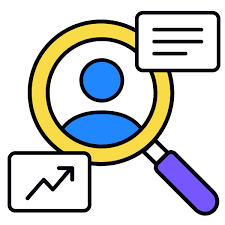

    
    <h1 align="center">Getting Started with UX</h1>

## 🎯 Learning Objectives
- What Is UX Design?
- What is a Design Sprint?
- What are UX design tools?

## 📝 Description
> UX stands for User Experience. It refers to the overall experience that a user has while interacting with a product, system, or service. UX design focuses on creating products that are user-centered, intuitive, and enjoyable to use.
 

#### What Is UX Design?
- In the context of software development, UX encompasses various aspects such as the visual design, usability, accessibility, and overall satisfaction of the user. It involves understanding the needs and goals of the users and designing interfaces that meet those needs effectively.
 

#### Why is UX Design Important?
- Good UX design involves conducting user research, creating user personas, wireframing and prototyping, and continuously iterating and improving the design based on user feedback. The goal is to create a seamless and delightful user experience that enhances the usability and effectiveness of the software.
 

- UX design is crucial because it directly impacts how users perceive and interact with a product. A well-designed user experience can lead to increased user engagement, customer satisfaction, and ultimately, the success of the software or application.

#### Difference between UI and UX
- User Interface (UI) refers to the visual elements and interactive components of a product or system. It includes the layout, colors, typography, buttons, icons, and other visual elements that users interact with. UI design focuses on creating an aesthetically pleasing and intuitive interface that is easy to navigate and use.

- User Experience (UX) encompasses the overall experience that a user has while interacting with a product or system. It includes the user's emotions, perceptions, and responses to the product. UX design focuses on understanding the user's needs, goals, and behaviors, and designing an experience that meets those needs effectively and efficiently.
 

#### What Is UX Design?
- User Experience (UX) design is a discipline that focuses on creating meaningful and enjoyable experiences for users when they interact with a product or system. It involves understanding the users' needs, goals, and behaviors, and designing the product in a way that meets those needs effectively and efficiently.

- UX design goes beyond just the visual appearance of a product. It encompasses the entire user journey, including how users feel, perceive, and respond to the product. It aims to create a seamless and intuitive experience that delights users and keeps them engaged.

- In the provided excerpt, there is a section titled 'What Is UX Design? - A Full Overview' that suggests watching a video for a comprehensive understanding of UX design. The video will likely provide more in-depth information and examples to help you grasp the concepts and principles of UX design."

 

#### What is a Design Sprint?
- A design sprint is a structured process for solving complex problems and testing new ideas in a short period of time. It typically involves a team of designers, developers, and other stakeholders working together to ideate, prototype, and test a solution within a week or less.

- Design sprints are often used to kickstart a project, explore new opportunities, or validate ideas before investing time and resources in full-scale development. They can help teams quickly generate and test multiple solutions, gather feedback from users, and make informed decisions based on real-world data.

- The design sprint process typically involves five key phases: understanding the problem, ideating solutions, prototyping concepts, testing with users, and iterating based on feedback. By following this structured approach, teams can rapidly move from problem definition to validated solution in a short amount of time.

#### What are UX design tools?
- UX design tools are software applications that help designers create, prototype, and test user interfaces and experiences. These tools provide a range of features and functionalities to support the design process, from wireframing and prototyping to user testing and collaboration.

- Some popular UX design tools include Figma, Sketch, Adobe XD, InVision, Axure RP, and Balsamiq. These tools offer a variety of features such as drag-and-drop interface design, interactive prototyping, real-time collaboration, and user testing integrations.

- UX design tools are essential for creating high-quality user experiences and streamlining the design process. They enable designers to quickly iterate on ideas, gather feedback from stakeholders, and test designs with real users. By using the right tools, designers can create more effective and engaging products that meet the needs of their users.

## 📹 Video
- Please watch the following videos:
    - [What Is UX Design?](https://www.youtube.com/watch?v=SRec90j6lTY)
    - [What is a Design Sprint? | Google UX Design Certificate](https://www.youtube.com/watch?v=xVvVaIWTuck&list=PLTZYG7bZ1u6oHnGp4Ib3n0y-CmFQdTW6r&index=2&t=211s)
    - [What are UX design tools?](https://www.youtube.com/watch?v=_PFqcMh7Uqk&list=PLTZYG7bZ1u6oHnGp4Ib3n0y-CmFQdTW6r&index=3)
 

## 🔧 Instructions
- If you don't have an account on [Figma](https://www.figma.com), please create one and familiarize yourself with the platform.
Also, you can download the [desktop app](https://www.figma.com/downloads/) for better experience.
