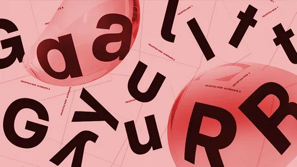

    
    <h1 align="center">Selecting and pairing fonts</h1>

## 📝 Description
> Selecting and pairing fonts and colors is an essential part of the design process. Fonts and colors play a crucial role in creating a visually appealing and cohesive design that conveys the right message to users. In this section, you will learn about different tools and resources that can help you choose the right fonts and colors for your design projects. These tools include font pairing tools, color palette generators, and resources for finding high-quality fonts and color schemes. By using these tools, you can create designs that are visually appealing, accessible, and engaging for users.

## 📋 Prerequisites
- [Introduction to web design](./01_web-design-concepts.md).
- [Introduction to typography](./02_typography.md).
- [Getting started with Figma](./03_getting_started_with_Figma.md).
- [Color Theory](./04_color_theory.md).

## 🎯 Learning Objectives
- Understand the importance of selecting and pairing fonts in design.
- Learn about different tools and resources for selecting fonts.
- Explore font pairing tools palette generators.
- Learn how to use these tools to create visually appealing and cohesive designs.

## 📹 Video

- Please watch the following videos:
    **How to choose fonts**
    - Choosing the right fonts is essential for creating visually appealing and readable designs. This video covers tips for choosing fonts that work well together and how to pair fonts effectively.
    <a href="https://www.youtube.com/watch?v=IviIMAItx2s" target="_blank">How to choose fonts</a>

     

    **Font Pairing**

    - Font pairing is the process of selecting and combining fonts that complement each other and create a harmonious design. This video explains the principles of font pairing and how to pair fonts effectively in your designs.

    <a href="https://www.youtube.com/watch?v=06Zjr8pTv4c" target="_blank">Font Pairing</a>

     
    
    **Text tool and fonts in Figma**
    - Figma offers a variety of text tools and features for working with fonts in your designs. This video covers how to use the text tool in Figma, change font styles, sizes, and colors, and work with different fonts in your designs.

    <a href="https://www.youtube.com/watch?v=5i-ebNTjad8&list=PLXDU_eVOJTx6zk5MDarIs0asNoZqlRG23&index=10" target="_blank">Text tool and fonts in Figma</a>

     

## 🔧 Instructions
- If you don't have an account on [Figma](https://www.figma.com), please create one and familiarize yourself with the platform.

## 🚀 Excersises
- Please complete the following excersises:
    - [ ] Cretae a new project in Figma and experiment with different fonts and colors to create a visually appealing design.

## 📫 Submittion
- This activity does not require submission. However, you can share your designs with your peers or mentors for feedback and suggestions.

    

        <h2>📌 Additional Materials</h2>
    

    

    <i>
        These are all optional, but if you're interested in exploring this topic further, here are some resources to help you.
    </i>

 
    <ul>
        <li><a href="https://www.youtube.com/watch?v=jPi-ISY0BO0" target="_blank">
        Best online tools for pairing fonts</a></li>
        </a></li>
    </ul>

