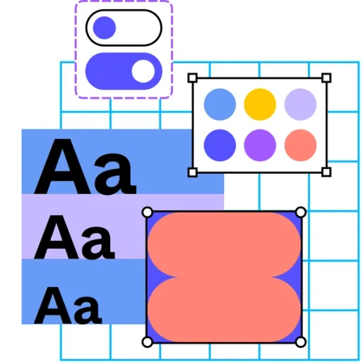

    
    <h1 align="center">Creating Style</h1>

## 📝 Description
> Styling is the process of adding visual design elements to a website to enhance its appearance and user experience. This includes defining fonts, colors, layout, and other design elements to create a cohesive and visually appealing design. Styling plays a crucial role in web design, as it helps to establish the look and feel of a website, convey branding and messaging, and engage users effectively. By mastering styling techniques, web designers can create designs that are aesthetically pleasing, functional, and user-friendly.

## 📋 Prerequisites
- [Introduction to web design](./01_web-design-concepts.md).
- [Introduction to typography](./02_typography.md).
- [Getting started with Figma](./03_getting_started_with_Figma.md).
- [Color Theory](./04_color_theory.md).
- [Selecting and pairing fonts](./05_fonts_and_colors.md).

## 🎯 Learning Objectives
- Understand the importance of styling in web design.
- Learn how to define fonts, colors, and layout in web design.
- Constraints and how to use them in Figma design.
- Effects and how to use them in Figma design.
- Rounded corners and how to use them in Figma design.

## 📹 Video

- Please watch the following videos:
    **Constraints**
    - Constraints are rules that define how elements behave when the parent frame is resized. This video explains how to use constraints in Figma to create responsive designs that adapt to different screen sizes and layouts.
    <a href="https://www.youtube.com/watch?v=LHY9cm_2zwU&list=PLXDU_eVOJTx6zk5MDarIs0asNoZqlRG23&index=4" target="_blank">Constraints</a>

     

    **Effects**
    - Effects are visual enhancements that can be applied to elements in Figma to create depth, shadows, and other effects. This video covers how to use effects in Figma to add visual interest and realism to your designs.
    <a href="https://www.youtube.com/watch?v=e1BRH09iwes&list=PLXDU_eVOJTx6zk5MDarIs0asNoZqlRG23&index=6" target="_blank">Effects</a>

     

    **Creating Styles**
    - Styles are design elements that define the appearance of text, shapes, and other elements in a design. This video explains how to create and apply styles in Figma to maintain consistency and efficiency in your designs.
    <a href="https://www.youtube.com/watch?v=gtQ_A3imzsg&list=PLXDU_eVOJTx6zk5MDarIs0asNoZqlRG23&index=8" target="_blank">Creating Styles</a>

    **Rounded Corners**
    - Rounded corners are a design element that softens the edges of elements and creates a more modern and friendly appearance. This video explains how to use rounded corners in Figma to create visually appealing designs with rounded edges.
    <a href="https://www.youtube.com/watch?v=L7dtFGUd-C0&list=PLXDU_eVOJTx6zk5MDarIs0asNoZqlRG23&index=9
    " target="_blank">Rounded Corners</a>

    **Create Reusable Color Style**
    - Creating reusable color styles in Figma allows you to define a set of colors that can be applied consistently throughout your design. By creating color styles, you can easily update the color palette of your design, maintain consistency, and ensure that all design elements use the correct colors. This feature streamlines the design process, promotes efficiency, and helps you create a cohesive and visually appealing design.
    <a href="https://www.youtube.com/watch?v=d01Ql9ZtVnk&t=8s" target="_blank">Create Reusable Color Style</a>
## 🔧 Instructions
- If you don't have an account on [Figma](https://www.figma.com), please create one and familiarize yourself with the platform.

## 🚀 Excersises
- Please complete the following excersises:
    - [ ] Create a Responsive Design with Constraints in Figma
    - [ ] Create a Depth Effect with Shadows in Figma
    - [ ] Create and Apply color and font Styles in Figma
    - [ ] Create Rounded Corners in Figma

## 📫 Submittion
- This activity does not require submittion but you can share your designs with your peers or mentors for feedback and suggestions.

