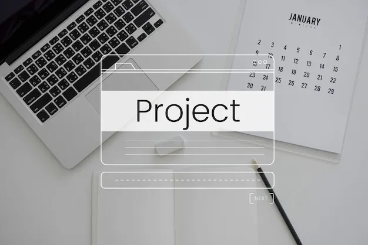

    
    <h1 align="center">Project</h1>

## 🎯 Learning Objectives
- Apply web design principles to create a visually appealing design.
- Demonstrate your understanding of layout, typography, color theory, and styling.
- Create a cohesive and engaging design that conveys the right message to users.

## 📋 Prerequisites
- [Introduction to web design](./01_web-design-concepts.md).
- [Introduction to typography](./02_typography.md).
- [Getting started with Figma](./03_getting_started_with_Figma.md).
- [Color Theory](./04_color_theory.md).
- [Selecting and pairing fonts](./05_fonts_and_colors.md).
- [Creating Style](./06_Figma_styling.md).

## 📝 Description
> The project is a practical exercise that allows you to apply the concepts you have learned in the previous sections. The project will test your knowledge of web design principles, layout, typography, color theory, and other essential concepts. You will be required to design a login page interface using Figma. The project will help you develop your design skills and prepare you for real-world design projects.

## 🔭 Requirements
#### General Requirements:
- Create a new project in Figma.
- Apply the concepts you have learned in the previous sections to create a visually appealing and cohesive design.
- Use your UX design skills to create a user-friendly interface.

#### Project Requirements:
- Design a login page interface that showcases your design skills.
- Use at least two different fonts in your design.
- Apply different colors to create a visually appealing design.

>This is what your project should look like:

## 🔧 Instructions
- If you don't have an account on [Figma](https://www.figma.com), please create one and familiarize yourself with the platform.

## 📫 Submittion
- Once you have completed the project, Shear a screenshot of your design in google classroom.
