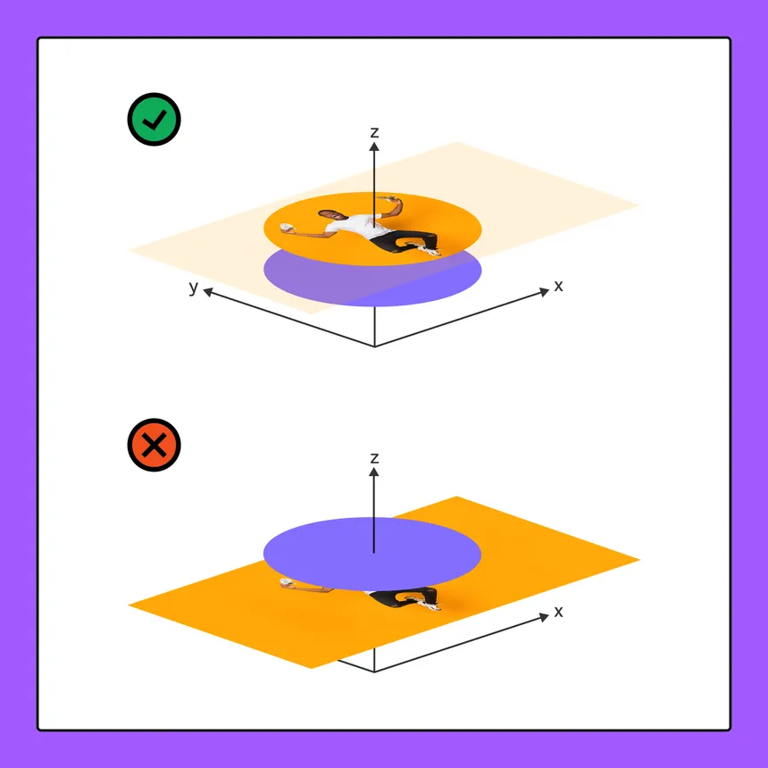

    
    <h1 align="center">Explore Design Features in Figma</h1>

## 📝 Description
> Figma is a collaborative interface design tool that enables real-time collaboration, prototyping, and vector-based graphics creation for teams. In this section, you will learn how to use Figma to create design elements, apply styling, and create responsive designs.

## 📋 Prerequisites
- [Introduction to web design](./01_web-design-concepts.md).
- [Introduction to typography](./02_typography.md).
- [Getting started with Figma](./03_getting_started_with_Figma.md).
- [Color Theory](./04_color_theory.md).
- [Selecting and pairing fonts](./05_fonts_and_colors.md).
- [Creating Style](./06_Figma_styling.md).

## 🎯 Learning Objectives
- Boolean Operations and how to use them in Figma design.
- Importing and exporting assets in Figma.
- Aligning and distributing objects in Figma.
- Layout grids and how to use them in Figma design.

## 📹 Video

- Please watch the following videos:
    **Boolean Operations**
    - Boolean operations are tools that allow you to combine shapes and create complex shapes by adding, subtracting, intersecting, or excluding shapes. This video explains how to use boolean operations in Figma to create custom shapes and designs.
    <a href="https://www.youtube.com/watch?v=8ZaX6qEcUCU&list=PLXDU_eVOJTx6zk5MDarIs0asNoZqlRG23&index=11" target="_blank">Boolean Operations</a>

     

    **Importing and Exporting Assets**
    - Importing and exporting assets is an essential part of the design process, as it allows you to bring in external assets such as images, icons, and other design elements into your Figma projects. This video covers how to import and export assets in Figma to enhance your designs.
    <a href="https://www.youtube.com/watch?v=saoB8uqUAH8&list=PLXDU_eVOJTx6zk5MDarIs0asNoZqlRG23&index=12" target="_blank">Importing and Exporting Assets</a>

     

    **Aligning and Distributing Objects**
    - Aligning and distributing objects is a crucial step in creating visually appealing and well-organized designs. This video explains how to use alignment and distribution tools in Figma to align and distribute objects evenly in your designs.
    <a href="https://www.youtube.com/watch?v=qQyaPqem0TA&list=PLXDU_eVOJTx6zk5MDarIs0asNoZqlRG23&index=13" target="_blank">Aligning and Distributing Objects</a>

     

    **Layout Grids**
    - Layout grids are tools that help you create consistent and well-organized designs by defining columns, rows, and gutters in your layout. This video covers how to use layout grids in Figma to create responsive designs and maintain consistency in your layouts.
    <a href="https://www.youtube.com/watch?v=zd8wrAdURN0&list=PLXDU_eVOJTx6zk5MDarIs0asNoZqlRG23&index=14" target="_blank">Layout Grids</a>

## 🔧 Instructions
- If you don't have an account on [Figma](https://www.figma.com), please create one and familiarize yourself with the platform.
## 🚀 Excersises
- Please complete the following excersises:
    - [ ] Please complete the following excersises:
    - [ ] Apply Boolean Operations in Figma
    - [ ] Import images and export assets in Figma
    - [ ] Align and distribute objects in Figma
    - [ ] Create a layout grid in Figma

## 📫 Submittion
- This activity does not require submittion but you can share your designs with your peers or mentors for feedback and suggestions.

    

        <h2>📌 Additional Materials</h2>
    

    

    <i>
        These are all optional, but if you're interested in exploring this topic further, here are some resources to help you.
    </i>

 
    <ul>
        <li><a href="https://www.youtube.com/watch?v=JJypv5NoVrI" target="_blank">Best Figma plagins</a></li>
    </ul>

