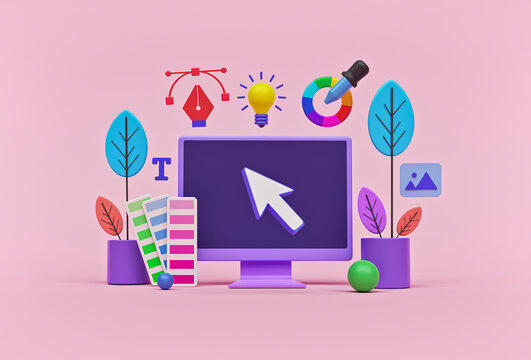

    
    <h1 align="center">Components</h1>

## 📝 Description
- In Figma, "Components" refer to reusable design elements that can be used throughout your project. They are like building blocks that allow you to create consistent and efficient designs.

    **Components in Figma have a few key characteristics:**

    - Reusability: Once you create a component, you can reuse it multiple times across your design. Any changes made to the main component will automatically update all instances of that component, ensuring consistency throughout your design.

    - Customizability: Components can be customized to fit your design needs. You can modify properties such as size, color, typography, and more. These changes can be applied to individual instances of the component or to the main component itself.

    - Nested Components: Components can be nested within each other, allowing you to create complex and hierarchical designs. For example, you can have a button component that contains an icon component, and both can be modified independently.

    - Variants: Figma also allows you to create variants of a component. Variants are different versions of a component that share the same base structure but have different properties. For example, you can create a button component with different states like "normal," "hover," and "pressed."
- Using components in Figma can greatly speed up your design process and ensure consistency across your project. They are particularly useful when working on large-scale projects or collaborating with a team, as they promote efficient design workflows and easy updates.

## 📋 Prerequisites
- [Introduction to web design](./01_web-design-concepts.md).
- [Introduction to typography](./02_typography.md).
- [Getting started with Figma](./03_getting_started_with_Figma.md).
- [Color Theory](./04_color_theory.md).
- [Selecting and pairing fonts](./05_fonts_and_colors.md).
- [Creating Style](./06_Figma_styling.md).
- [Design Features in Figma Part 1](./08_design_features_in_figma_part_1.md).
- [Design Features in Figma Part 2](./09_design_features_in_figma_part_2.md).
- [Design Features in Figma Part 3](./10_design_features_in_figma_part_3.md).

## 🎯 Learning Objectives
- Understand the concept of components in Figma.
- Learn how to create and use components in Figma.
- Explore the benefits of using components in design projects.
- Learn how to create nested components and variants in Figma.
- Practice creating and customizing components in Figma.

## 📹 Video

- Please watch the following videos:

    **Components Basics in Figma**
    - Components in Figma are design elements that you can reuse across your project. They serve as the building blocks of your design, allowing you to maintain consistency and efficiency. You can create a component once and then duplicate it wherever needed. If you modify the original component, all its instances will update automatically. Components can be customized individually, nested within each other for complex designs, and can have variants for different states or versions. This feature of Figma streamlines the design process, especially in large-scale projects or collaborative environments.
    
    - <a href="https://www.youtube.com/watch?v=k74IrUNaJVk&list=PLXDU_eVOJTx5LSjOmeBYMuvaa4UayfMe4" target="_blank">Components Basics in Figma</a>

 

**How to organize your components in Figma**
- Organizing your components in Figma is essential for maintaining a clean and efficient design workflow. By grouping related components together, you can easily locate and reuse them throughout your project. Figma provides several features to help you organize your components effectively, such as naming conventions, component libraries, and component sets. These tools allow you to create a structured and accessible component library that promotes consistency and collaboration in your design projects.

    - <a href="https://www.youtube.com/watch?v=FFXNLmt-JY4&list=PLXDU_eVOJTx5LSjOmeBYMuvaa4UayfMe4&index=2" target="_blank">How to organize your components in Figma</a>

 

**Swapping and States in Figma**
- Swapping and states in Figma allow you to create interactive and dynamic designs. By defining different states for your components, such as hover or pressed, you can simulate user interactions and animations. Swapping between states enables you to preview how your design will respond to user input, providing a more realistic and engaging experience. Figma's interactive features empower you to design prototypes that accurately reflect the final product, helping you communicate your ideas effectively and gather feedback from stakeholders.

    - <a href="https://www.youtube.com/watch?v=IHEh9HFBtFU&list=PLXDU_eVOJTx5LSjOmeBYMuvaa4UayfMe4&index=3" target="_blank">Swapping and States in Figma</a>

    
## 🔧 Instructions
- If you don't have an account on [Figma](https://www.figma.com), please create one and familiarize yourself with the platform.
## 🚀 Excersises
- Please complete the following excersises:
    - [ ] Create a new project in Figma.
    - [ ] Create a component for a button with different states (normal, hover, pressed).
    - [ ] Create a nested component that contains an icon and a text element.
    - [ ] Create variants of a component for different button styles (primary, secondary, tertiary).
    - [ ] Organize your components using Figma's component libraries and sets.
    - [ ] Experiment with swapping between component states to create interactive designs.
    - [ ] Share your project with a mentor or peer for feedback.

## 📫 Submittion
- Once you have completed the exercises, Shear a screenshot of your design to the mentor for feedback.

    

        <h2>📌 Additional Materials</h2>
    

    <ul>
    <li><a href="https://www.youtube.com/watch?v=KnmxD8LvHmA" target="_blank">Everything you need to know about Figma Components</a></li>
    </ul>

