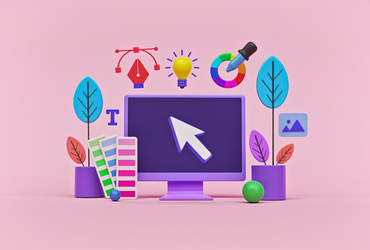

    
    <h1 align="center">Create Your Design In Figma</h1>

## 📝 Description
> In Figma, "Components" refer to reusable design elements that can be used throughout your project. They are like building blocks that allow you to create consistent and efficient designs.

## 📋 Prerequisites
- [Introduction to web design](./01_web-design-concepts.md).
- [Introduction to typography](./02_typography.md).
- [Getting started with Figma](./03_getting_started_with_Figma.md).
- [Color Theory](./04_color_theory.md).
- [Selecting and pairing fonts](./05_fonts_and_colors.md).
- [Creating Style](./06_Figma_styling.md).
- [Design Features in Figma Part 1](./08_design_features_in_figma_part_1.md).
- [Design Features in Figma Part 2](./09_design_features_in_figma_part_2.md).
- [Design Features in Figma Part 3](./10_design_features_in_figma_part_3.md).
- [Components](./12_Create_Your_Design_In_Figma_part_1.md).

## 🎯 Learning Objectives
- How to create a Shearable team library.
- Create Reusable Color Style 
- Build Reusable Components

## 📹 Video
**How to create a Shearable team library**
- Creating a Shearable team library in Figma allows you to share design assets, components, and styles with your team members. This feature streamlines the design process, promotes consistency, and ensures that everyone is working with the latest design elements. By creating a Shearable team library, you can collaborate more effectively, reduce duplication of work, and maintain a unified design system across your projects.

    - <a href="https://www.youtube.com/watch?v=79T8Q6OBmRk&list=PLXDU_eVOJTx5LSjOmeBYMuvaa4UayfMe4&index=4" target="_blank">How to create a Shearable team library</a>

     

**Create Reusable Color Style**
- Creating reusable color styles in Figma allows you to define a set of colors that can be applied consistently throughout your design. By creating color styles, you can easily update the color palette of your design, maintain consistency, and ensure that all design elements use the correct colors. This feature streamlines the design process, promotes efficiency, and helps you create a cohesive and visually appealing design.

    - <a href="https://www.youtube.com/watch?v=d01Ql9ZtVnk&list=PLXDU_eVOJTx5LSjOmeBYMuvaa4UayfMe4&index=7" target="_blank">Create Reusable Color Style</a>
     

**Build Reusable Components**
- Building reusable components in Figma allows you to create design elements that can be used across your project. Components are like building blocks that enable you to maintain consistency, efficiency, and scalability in your design. By creating reusable components, you can easily update design elements, ensure consistency, and streamline the design process. This feature is particularly useful when working on large-scale projects or collaborating with a team.

    - <a href="https://www.youtube.com/watch?v=k8y9SRPB78Q&list=PLXDU_eVOJTx5LSjOmeBYMuvaa4UayfMe4&index=8" target="_blank">Build Reusable Components</a>

## 🔧 Instructions
- If you don't have an account on [Figma](https://www.figma.com), please create one and familiarize yourself with the platform.
## 🚀 Excersises
- Please complete the following excersises:
    - [ ] Create a Shearable team library and shear it with your partner.
    - [ ] Applay Reusable Color Style.
    - [ ] Build Reusable Components.

## 📫 Submittion
- Once you complete the excersises, Shear your project link to the mentor for review.

    

        <h2>📌 Additional Materials</h2>
    

    <ul>
    <li><a href="https://www.youtube.com/watch?v=KnmxD8LvHmA" target="_blank">Everything you need to know about Figma Components</a></li>
    </ul>

