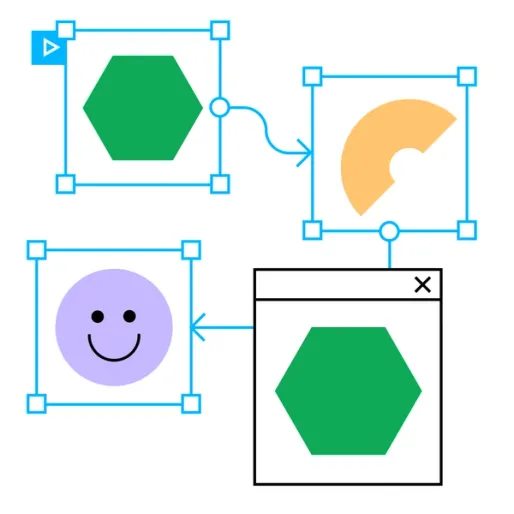

    
    <h1 align="center">Prototype While You Design</h1>

## 📝 Description
> Prototyping is an essential part of the design process. It allows you to test your ideas, gather feedback, and refine your designs before you start coding. In this section, you will learn how to create interactive prototypes using Figma. You will learn how to create clickable prototypes, add animations, and create interactive forms. By the end of this section, you will have the skills to create high-fidelity prototypes that look and feel like real websites or apps.

## 📋 Prerequisites
- [Introduction to Web Design](./web-design/01_web-design-concepts.md).
- [Typography](./02_typography.md)
- [Color Theory](./web-design/04_color_theory.md).
- [Getting started with Figma](./web-design/03_getting_started_with_Figma.md).
- [Selecting and pairing fonts](./web-design/05_fonts_and_colors.md).
- [Creating Style](./web-design/06_Figma_styling.md).
- [Design Features in Figma Part 1](./web-design/08_design_features_in_figma_part_1.md).
- [Design Features in Figma Part 2](./web-design/09_design_features_in_figma_part_2.md).
- [Design Features in Figma Part 3](./web-design/10_design_features_in_figma_part_3.md).
- [Components](./web-design/12_Create_Your_Design_In_Figma_part_1.md).
- [Components Part 2](./web-design/13_Create_Your_Design_In_Figma_part_2.md).
- [Create Your Design In Figma](./web-design/15_Create_Your_Design_In_Figma_part_3.md).
- [Prototyping](./web-design/16_prototyping_part_1.md).
- [Transaction](./web-design/17_prototyping_part_2.md).
- [Prototype While You Design](./web-design/19_prototyping_part_3.md).
- [Embeds](./web-design/20_embeds.md).

## 🎯 Learning Objectives
- Prototype while you design.
- Create interactive prototypes.    
- Add animations to your prototypes.
- Prepare for Handoff 

## 📹 Video

- Please watch the following videos:
    

    **Build Prototypes**
    - Prototyping is an essential part of the design process. It allows you to test your ideas, gather feedback, and refine your designs before you start coding. In this video, you will learn how to create interactive prototypes using Figma. You will learn how to create clickable prototypes, add animations, and create interactive forms. By the end of this section, you will have the skills to create high-fidelity prototypes that look and feel like real websites or apps.

    <a href="https://www.youtube.com/watch?v=lTIeZ2ahEkQ&list=PLXDU_eVOJTx7QHLShNqIXL1Cgbxj7HlN4&index=4" target="_blank">Build Prototypes</a>
    
     

    **Prepare for Handoff**
    - Preparing for handoff is an essential part of the design process. It allows you to share your designs with developers and other stakeholders effectively. In this video, you will learn how to prepare your designs for handoff using Figma. You will learn how to create design specs, export assets, and generate code snippets. By the end of this section, you will have the skills to share your designs with your team and get feedback effectively.

    <a href="https://www.youtube.com/watch?v=EQ_FL6u8EyM&list=PLXDU_eVOJTx7QHLShNqIXL1Cgbxj7HlN4&index=5" target="_blank">Prepare for Handoff</a>
    

## 🔧 Instructions
- If you don't have an account on [Figma](https://www.figma.com/), please create one and familiarize yourself with the platform.
## 🚀 Excersises
- Please complete the following excersises:
    - [ ] Create a high-fidelity prototype of your design.

## 📫 Submittion
- This exercise dose not require submittion. However, you can share your work with your peers and mentor for feedback.

    

        <h2>📌 Additional Materials</h2>
    

    

    <i>
        These are all optional, but if you're interested in exploring this topic further, here are some resources to help you.
    </i>

 
    <ul>
    <li><a href="https://www.youtube.com/watch?v=Vx8jyVTazew" target="_blank">How to Put Prototype Video in Device Mockup</a></li>
    </ul>

