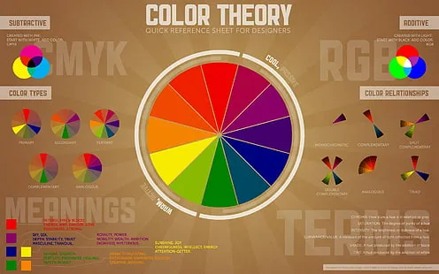

    
    <h1 align="center">Color Theory</h1>

#### 🕒 Estimated time: 8 h
## 📝 Description
> Color theory is a set of principles and guidelines that help designers understand how colors work together and how they can be used effectively in design. It involves the study of color relationships, color harmonies, color psychology, and color symbolism to create visually appealing and meaningful designs. Understanding color theory can help designers make informed decisions about color selection, create color palettes that convey specific moods or messages, and enhance the overall visual impact of their designs.

## 📋 Prerequisites
- [ ] [Introduction to web design](./01_web-design-concepts.md).

- [ ] [Introduction to typography](./02_typography.md).

- [ ] [Getting started with Figma](./03_getting_started_with_Figma.md).

## 🎯 Learning Objectives
- [ ] Understand the basic principles of color theory and how colors interact with each other.

- [ ] Learn about color harmonies and how to create harmonious color palettes.

- [ ] Explore the psychological and emotional effects of color and how they can be used in design.

- [ ] Graidient colors and how to use them in Figma design.

- [ ] Learn how to use the color picker tool in Figma to sample colors from your designs.

## 📹 Video

- Please watch the following videos:
     
    **How to choose colors**
    - Choosing colors is an essential part of the design process. tips to help you choose colors that work well together:
     
    - <a href="https://www.youtube.com/watch?v=KMS3VwGh3HY" target="_blank">How to choose colors</a>

    

     

    **Color Theory for Beginners**
    - Color theory is a fundamental concept in design that can help you create visually appealing and harmonious color palettes. This video covers the basics of color theory, including the color wheel, color harmonies, and color schemes.
     
    <a href="https://www.youtube.com/watch?v=AvgCkHrcj90" target="_blank">Color Theory for Beginners</a>

    
     

    **Color Psychology**
    - Color psychology is the study of how colors affect human behavior and emotions. This video explores the psychological and emotional effects of different colors and how they can be used in design to evoke specific responses from users.
     
    <a href="https://www.youtube.com/watch?v=1i8s8knHFTs" target="_blank">Color Psychology</a>

    

     

    **Color Harmonies**
    - Color harmonies are combinations of colors that are visually appealing and work well together. This video explains the different types of color harmonies, such as complementary, analogous, and triadic, and how to create harmonious color palettes using these principles.
     
    <a href="https://www.youtube.com/watch?v=rZb84-cKkBc" target="_blank">Color Harmonies</a>

    

     

    **Gradient Colors**
    - Gradient colors are a popular design trend that involves blending two or more colors together to create a smooth transition between them. This video explains how to use gradient colors in design and how to create gradient color effects in Figma.
     
    <a href="https://www.youtube.com/watch?v=gUb303HQSGk&list=PLXDU_eVOJTx6zk5MDarIs0asNoZqlRG23&index=5" target="_blank">Gradient Colors</a>

    

     

    **Color Picker Tool**
    - The color picker tool is used to select colors from an image or design and apply them to other elements. This video explains how to use the color picker tool in Figma and how to sample colors from your designs.
     
    <a href="https://www.youtube.com/watch?v=V7waqacFYZs&list=PLXDU_eVOJTx6zk5MDarIs0asNoZqlRG23&index=7" target="_blank">Color Picker Tool</a>

    

## 🔧 Instructions
- If you don't have an account on [Figma](https://www.figma.com), please create one and familiarize yourself with the platform.
Also, you can download the [desktop app](https://www.figma.com/downloads/) for better experience.

## 🚀 Excersises
- Please complete the following excersises:
- [ ] Create a color palette using the color wheel and color harmonies.
- [ ] Create a design using gradient colors.
- [ ] Experiment with different color combinations and color schemes to see how they affect the overall look and feel of your design.

## 📫 Submittion
- This exercise does not require submission. However, you can share your work with your peers or mentors for feedback.

    

        <h2>📌 Additional Materials</h2>
    

    

    <i>
        These are all optional, but if you're interested in exploring this topic further, here are some resources to help you.
    </i>

 
    <ul>
        <li><a href="https://www.youtube.com/watch?v=-4lMJ4is2pE" target="_blank">Color Theory in UI Design</a></li>
    </ul>

------

_If you spot any bugs or issues in this activity, you can [open an issue with your proposed change](https://github.com/Kick-StartDev/web-development-basic-curriculum/issues/new)_