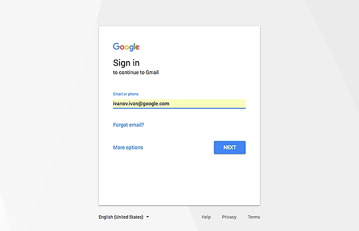

    
    <h1 align="center">Project</h1>

## 📝 Description
> The project is a practical exercise that allows you to apply the concepts you have learned in the previous sections. The project will test your knowledge of web design principles, layout, typography, color theory, and other essential concepts.

## 📋 Prerequisites
- [ ] [Introduction to web design](./01_web-design-concepts.md).
- [ ] [Introduction to typography](./02_typography.md).
- [ ] [Getting started with Figma](./03_getting_started_with_Figma.md).
- [ ] [Color Theory](./04_color_theory.md).
- [ ] [Selecting and pairing fonts](./05_fonts_and_colors.md).
- [ ] [Creating Style](./06_Figma_styling.md).

## 🎯 Learning Objectives
- [ ] Apply web design principles to create a visually appealing design.
- [ ] Demonstrate your understanding of layout, typography, color theory, and styling.
- [ ] Create a cohesive and engaging design that conveys the right message to users.

## 🔭 Requirements
#### General Requirements:
- [ ] Create a new project in Figma.
- [ ] Experiment with different fonts, colors, and layout options.
- [ ] Apply the concepts you have learned in the previous sections to create a visually appealing and cohesive design.

#### Project Requirements:

- [ ] Design a login page interface that showcases your design skills.
- [ ] Use at least two different fonts in your design.
- [ ] Apply styling effects to enhance the visual appeal of your design.
- [ ] Use constraints to create a responsive design that adapts to different screen sizes.

>This is what your project should look like:

## 🔧 Instructions
- If you don't have an account on [Figma](https://www.figma.com), please create one and familiarize yourself with the platform.

## 📫 Submittion
- Once you have completed the project, Shear a screenshot of your design and submit it to the mentor for feedback.

------

_If you spot any bugs or issues in this activity, you can [open an issue with your proposed change](https://github.com/Kick-StartDev/web-development-basic-curriculum/issues/new)_