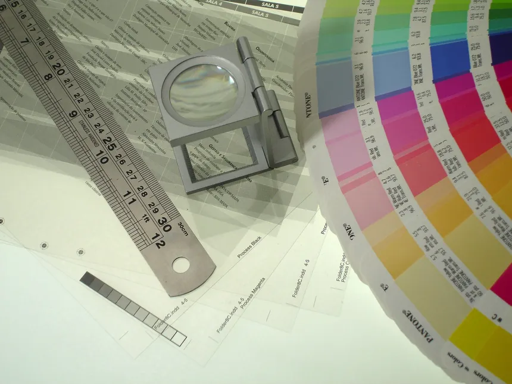
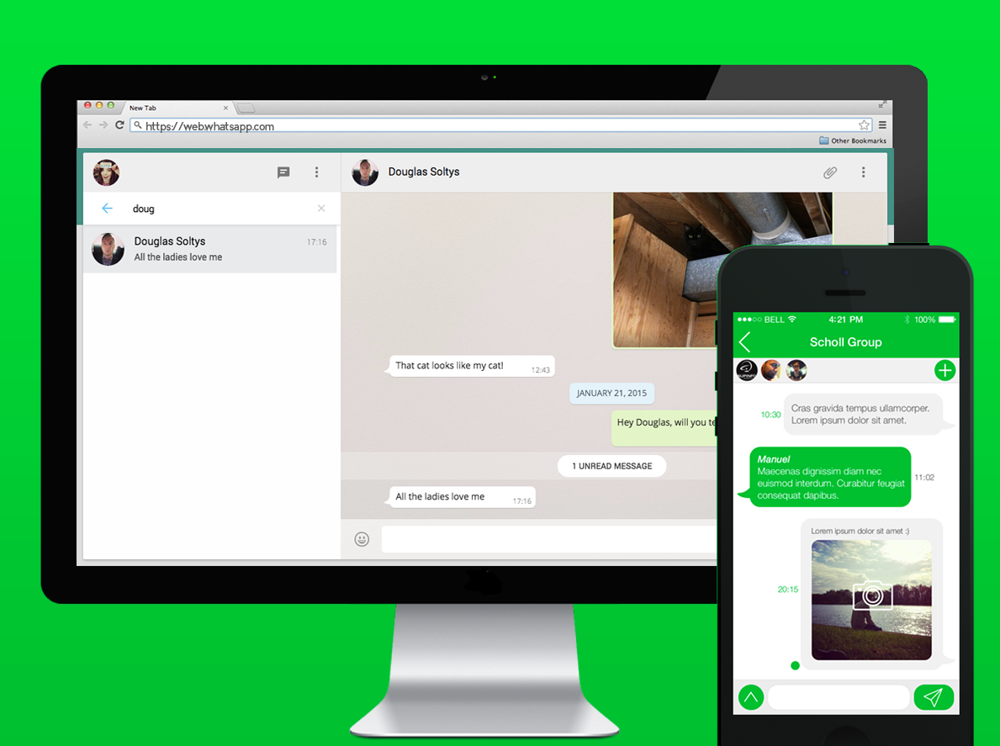

    
    <h1 align="center">Project</h1>

## 📝 Description
> The project is a practical exercise that allows you to apply the concepts you have learned in the previous sections. 

## 📋 Prerequisites
- [ ] [Introduction to web design](./01_web-design-concepts.md).
- [ ] [Introduction to typography](./02_typography.md).
- [ ] [Getting started with Figma](./03_getting_started_with_Figma.md).
- [ ] [Color Theory](./04_color_theory.md).
- [ ] [Selecting and pairing fonts](./05_fonts_and_colors.md).
- [ ] [Creating Style](./06_Figma_styling.md).
- [ ] [Design Features in Figma Part 1](./08_design_features_in_figma_part_1.md).
- [ ] [Design Features in Figma Part 2](./09_design_features_in_figma_part_2.md).
- [ ] [Design Features in Figma Part 3](./10_design_features_in_figma_part_3.md).
- [ ] [Components](./12_Create_Your_Design_In_Figma_part_1.md).
- [ ] [Reusable Components](./13_Create_Your_Design_In_Figma_part_2.md).

## 🎯 Learning Objectives
- [ ] Apply web design principles to create a visually appealing design.
- [ ] Demonstrate your understanding of layout, typography, color theory, and styling.
- [ ] Create a cohesive and engaging design that conveys the right message to users.
- [ ] Figma Guides and how to use them in Figma design.
- [ ] Easing Curves and how to use them in Figma design.
- [ ] Variants and how to use them in Figma design.
- [ ] Interactive Components and how to use them in Figma design.
- [ ] Masks and how to use them in Figma design.
- [ ] Branching and Merging and how to use them in Figma design.

## 🔭 Requirements
#### General Requirements:
- [ ] Create a new project in Figma.
- [ ] Experiment with different fonts, colors, and layout options.
- [ ] Apply the concepts you have learned in the previous sections to create a visually appealing and cohesive design.

#### Project Requirements:

- [ ] Create WhatApp Chat Interface. for both mobile and desktop view.
    - Student 1 should design the mobile view.
    - Student 2 should design the desktop

>This is what your project should look like:

## 🔧 Instructions
- If you don't have an account on [Figma](https://www.figma.com), please create one and familiarize yourself with the platform.

## 📫 Submittion
- Once you have completed the project, Shear a screenshot of your design and submit it to the mentor for feedback.

------

_If you spot any bugs or issues in this activity, you can [open an issue with your proposed change](https://github.com/Kick-StartDev/web-development-basic-curriculum/issues/new)_