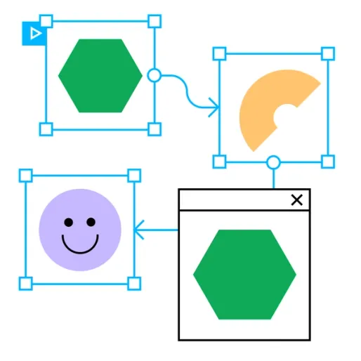

    
    <h1 align="center">Prototype While You Design</h1>

## 📝 Description
> Prototyping is an essential part of the design process. It allows you to test your ideas, gather feedback, and refine your designs before you start coding. In this section, you will learn how to create interactive prototypes using Figma. You will learn how to create clickable prototypes, add animations, and create interactive forms. By the end of this section, you will have the skills to create high-fidelity prototypes that look and feel like real websites or apps.

## 📋 Prerequisites
- [ ] [Introduction to Web Design](./web-design/01_web-design-concepts.md).
- [ ] [Typography](./02_typography.md)
- [ ] [Color Theory](./web-design/04_color_theory.md).
- [ ] [Getting started with Figma](./web-design/03_getting_started_with_Figma.md).
- [ ] [Selecting and pairing fonts](./web-design/05_fonts_and_colors.md).
- [ ] [Creating Style](./web-design/06_Figma_styling.md).
- [ ] [Design Features in Figma Part 1](./web-design/08_design_features_in_figma_part_1.md).
- [ ] [Design Features in Figma Part 2](./web-design/09_design_features_in_figma_part_2.md).
- [ ] [Design Features in Figma Part 3](./web-design/10_design_features_in_figma_part_3.md).
- [ ] [Components](./web-design/12_Create_Your_Design_In_Figma_part_1.md).
- [ ] [Components Part 2](./web-design/13_Create_Your_Design_In_Figma_part_2.md).
- [ ] [Create Your Design In Figma](./web-design/15_Create_Your_Design_In_Figma_part_3.md).
- [ ] [Prototyping](./web-design/16_prototyping_part_1.md).
- [ ] [Transaction](./web-design/17_prototyping_part_2.md).

## 🎯 Learning Objectives
- [ ] Device Frames and how to use them in Figma design.
- [ ] Device frames and Scrolling 
- [ ] Overlay in Figma design.

## 📹 Video

- Please watch the following videos:
    

    **Device Frames and how to use them in Figma design**
    - Device frames are a useful feature in Figma that allows designers to visualize their designs on different devices. By using device frames, designers can see how their designs will look on various screen sizes and resolutions, helping them create responsive and user-friendly interfaces. In this video, you will learn how to use device frames in Figma and how to customize them to fit your design needs.

    <a href="https://www.youtube.com/watch?v=ST6DOO11zuA&list=PLXDU_eVOJTx7aqRW3Skp1aRT9ktC3ctqA&index=6" target="_blank">Device Frames and how to use them in Figma design</a>
    
     

     

    **Overlay**
    - Overlays are a great way to add interactivity to your designs. They allow you to create pop-ups, modals, and other interactive elements that enhance the user experience. In this video, you will learn how to create overlays in Figma and how to use them to create interactive prototypes.

    <a href="https://www.youtube.com/watch?v=t82XRda5DnY&list=PLXDU_eVOJTx7aqRW3Skp1aRT9ktC3ctqA&index=7" target="_blank">Overlay</a>
    

     

    **Mockups**
    - Mockups are a great way to present your designs in a realistic context. They help clients and stakeholders visualize how the final product will look and feel, making it easier to communicate your design ideas. In this video, you will learn how to create mockups in Figma and how to use them to showcase your designs effectively.

    <a href="https://www.youtube.com/watch?v=XVbw79i3poc" target="_blank">Mockups</a>
    

## 🔧 Instructions
- If you don't have an account on [Figma](https://www.figma.com/), please create one and familiarize yourself with the platform.
## 🚀 Excersises
- Please complete the following excersises:
    - [ ] Use Device frames and Mockups in your figma design.

## 📫 Submittion
- This exercise dose not require submittion. However, you can share your work with your peers and mentor for feedback.

    

        <h2>📌 Additional Materials</h2>
    

    

    <i>
        These are all optional, but if you're interested in exploring this topic further, here are some resources to help you.
    </i>

 
    <ul>
    <li><a href="https://www.youtube.com/watch?v=Vx8jyVTazew" target="_blank">How to Put Prototype Video in Device Mockup</a></li>
    </ul>

------

_If you spot any bugs or issues in this activity, you can [open an issue with your proposed change](https://github.com/Kick-StartDev/web-development-basic-curriculum/issues/new)_