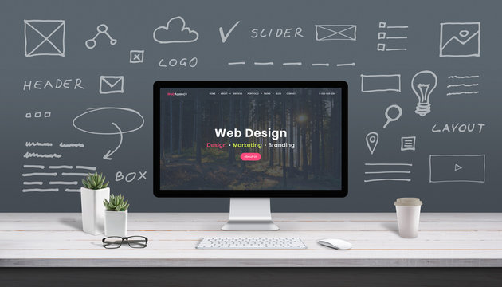

    
    <h1 align="center">Web design full course</h1>

## 📝 Description
> Web design full course focuses on teaching practical web design skills that are essential for beginners. The course covers the basics of web design, typography, color theory, and Figma basics. The course is designed to help beginners understand the basics of web design and how to use Figma to create designs. The course is divided into two months, with each month focusing on different aspects of web design. The course is designed to be interactive and engaging, with hands-on projects and exercises to help reinforce learning. By the end of the course, students will have a solid understanding of web design principles and how to use Figma to create designs.

## 📋 Prerequisites
- [ ] [Introduction to Web Design](./web-design/01_web-design-concepts.md).
- [ ] [Typography](./web-design/02_typography.md)
- [ ] [Color Theory](./web-design/04_color_theory.md).
- [ ] [Getting started with Figma](./web-design/03_getting_started_with_Figma.md).
- [ ] [Selecting and pairing fonts](./web-design/05_fonts_and_colors.md).
- [ ] [Creating Style](./web-design/06_Figma_styling.md).
- [ ] [Design Features in Figma Part 1](./web-design/08_design_features_in_figma_part_1.md).
- [ ] [Design Features in Figma Part 2](./web-design/09_design_features_in_figma_part_2.md).
- [ ] [Design Features in Figma Part 3](./web-design/10_design_features_in_figma_part_3.md).
- [ ] [Components](./web-design/12_Create_Your_Design_In_Figma_part_1.md).
- [ ] [Components Part 2](./web-design/13_Create_Your_Design_In_Figma_part_2.md).
- [ ] [Create Your Design In Figma](./web-design/15_Create_Your_Design_In_Figma_part_3.md).
- [ ] [Prototyping](./web-design/16_prototyping_part_1.md).
- [ ] [Transaction](./web-design/17_prototyping_part_2.md).
- [ ] [Prototype While You Design](./web-design/19_prototyping_part_3.md).
- [ ] [Embeds](./web-design/20_embeds.md).
- [ ] [Prototyping Part 4](./web-design/21_prototyping_part_4.md).

## 🎯 Learning Objectives
- [ ] Learn typography and color theory.
- [ ] Learn how to use Figma to create designs.
- [ ] Learn how to create high-fidelity prototypes.
- [ ] Learn how to prepare designs for handoff.

## 📹 Video

- Please watch the following videos:
    
    **Web Design Full Course**
    

     
    **Recreate Figma logo**
    

     

    **Create a Navigation Menu Component in Figma**
    
    
## 🔧 Instructions
- If you don't have an account on [Figma](https://www.figma.com/), please create one and familiarize yourself with the platform.

## 🚀 Excersises
- Please complete the following excersises:
    - [ ] Recreate the Figma logo.
    - [ ] Create a Navigation Menu.

## 📫 Submittion
- This excersise does not require submittion. however, you can share your design with your peers and mentors for feedback.

------

_If you spot any bugs or issues in this activity, you can [open an issue with your proposed change](https://github.com/Kick-StartDev/web-development-basic-curriculum/issues/new)_